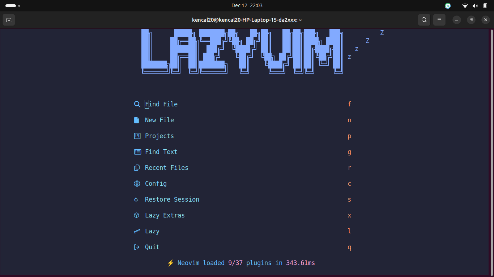
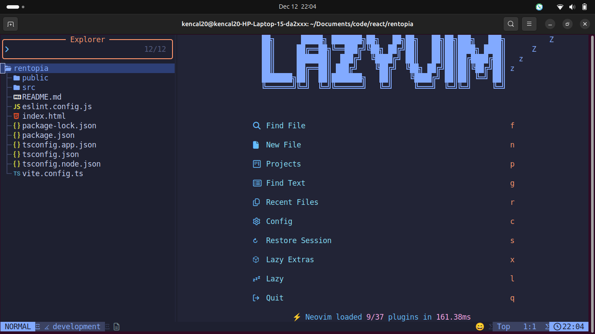
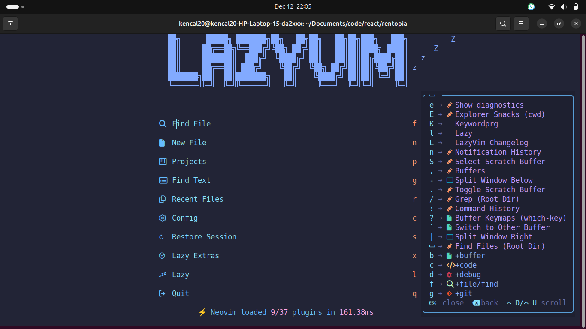

# 💤 LazyVim

A starter template for [LazyVim](https://github.com/LazyVim/LazyVim).
Refer to the [documentation](https://lazyvim.github.io/installation) to get started.

# Neovim + LazyVim Setup for React / TypeScript Development



This repository contains my **personal Neovim configuration** optimized for **React and TypeScript development**. It uses **LazyVim** as the core framework with **Lazy.nvim** for plugin management, along with auto-save and live diagnostics.

---

## Features

### Core Plugins

* **[LazyVim](https://github.com/LazyVim/LazyVim)** – Base framework for modular Neovim configuration.
* **[Lazy.nvim](https://github.com/folke/lazy.nvim)** – Lazy-loading plugin manager.
* **[nvim-tree](https://github.com/nvim-tree/nvim-tree.lua)** – File explorer on the **right side**.



* **[bufferline.nvim](https://github.com/akinsho/bufferline.nvim)** – Shows buffers in a clean, slanted style.
* **[nvim-web-devicons](https://github.com/nvim-tree/nvim-web-devicons)** – File type icons.

### Programming Language Support

* **TypeScript & JavaScript** via `tsserver`.
* **Python** via `pyright`.
* **Treesitter** parsers for syntax highlighting:

  * `bash`, `html`, `javascript`, `json`, `lua`, `markdown`, `python`, `tsx`, `typescript`, `yaml`, and more.

### Editor Features

* **Auto-save**: Automatically saves files on leaving insert mode or after text changes using [`auto-save.nvim`](https://github.com/Pocco81/auto-save.nvim).
* **Completion**: `nvim-cmp` with emoji support.
* **Diagnostics**: Live LSP diagnostics with inline virtual text, gutter signs, and underlines.
* **Navigation**: Keymaps for navigating diagnostics:

  * `<leader>e` – show floating diagnostics
  * `[d` / `]d` – previous / next diagnostic

### Fuzzy Finder

* **[Telescope](https://github.com/nvim-telescope/telescope.nvim)** for fast file searching.
* Plugin-specific file searching (`<leader>fp`) within the Neovim project.

### LSP & Development Tools

* **Mason.nvim** to ensure essential development tools are installed:

  * `stylua`, `shellcheck`, `shfmt`, `flake8`
* **TypeScript helpers** via `typescript.nvim`.

### Snippets

* **LuaSnip** + **friendly-snippets** for code snippet support.

### Status Line

* **Lualine** with a simple, customizable display, including emoji indicators.

---

## Installation

1. **Clone this repository**:

```bash
git clone https://github.com/kencal20/nvim_lazy_setup.git ~/.config/nvim
```

2. **Install Neovim** (v0.9+ recommended).

3. **Install Node.js & npm** (for TypeScript, React):

```bash
npm install -g typescript
```

4. **Open Neovim**:

```bash
nvim
```

* Lazy.nvim will automatically bootstrap and install all plugins.

5. **Verify LSP & Treesitter parsers**:

* Mason will install missing language servers.
* Treesitter will automatically install required parsers.

---

## Keybindings

> **Note:** The `<leader>` key is set to **Space** by default.



| Key          | Action                                    |
| ------------ | ----------------------------------------- |
| `<leader>fp` | Find plugin/project files using Telescope |
| `<leader>e`  | Show diagnostics in floating window       |
| `[d` / `]d`  | Navigate to previous/next diagnostic      |

---

## Notes

* **Leader key**: Set to **Space** by default.
* **All keybindings using `<leader>`** reflect this.
* **Auto-save** does not interfere with LSP diagnostics. Errors are updated live while typing.
* **NvimTree** is set to appear on the **right side** by default.
* This setup is tailored for **fast React/TypeScript development**, but can be extended for other languages.

---

## Contributing

Feel free to fork and modify this configuration. Open a PR if you have improvements, especially for additional plugin setups or LSP integrations.

---

## References

* [LazyVim](https://github.com/LazyVim/LazyVim)
* [Lazy.nvim](https://github.com/folke/lazy.nvim)
* [nvim-tree.lua](https://github.com/nvim-tree/nvim-tree.lua)
* [auto-save.nvim](https://github.com/Pocco81/auto-save.nvim)
* [nvim-cmp](https://github.com/hrsh7th/nvim-cmp)
* [Telescope.nvim](https://github.com/nvim-telescope/telescope.nvim)
* [Treesitter](https://github.com/nvim-treesitter/nvim-treesitter)
* [LuaSnip](https://github.com/L3MON4D3/LuaSnip)
