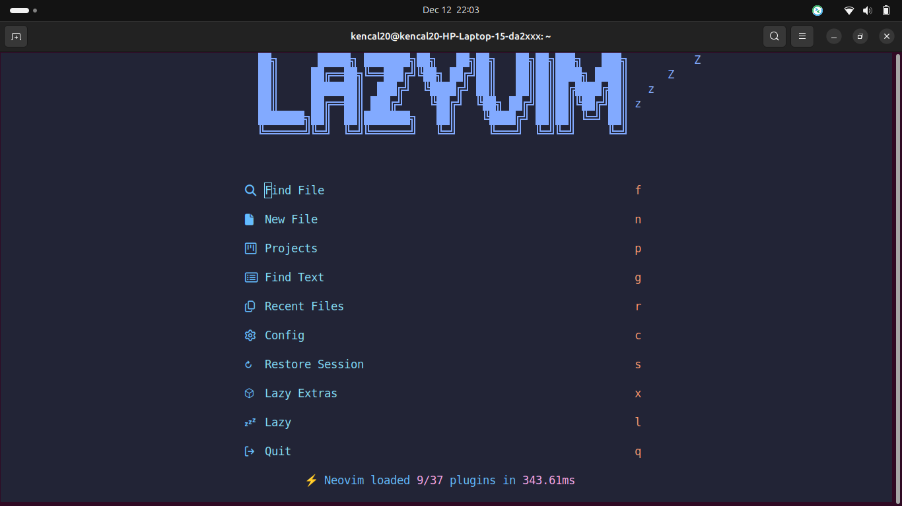

# ⚡ LazyVim Pro Development Environment

<div align="center">



# 🚀 Modern Neovim Development Workspace

### Fast • Beautiful • Fully Configured • Production Ready

Built on **LazyVim** with a carefully crafted developer experience for modern web and backend development.

<br>


<br><br>

<a href="#-features">Features</a> • <a href="#-requirements--downloads">Requirements</a> • <a href="#-installation">Installation</a> • <a href="#-keybindings">Keybindings</a> • <a href="#-language-support">Languages</a> • <a href="#-included-plugin-ecosystem">Plugins</a>

</div>

---

## ✨ Why This Setup?

Forget spending hours configuring Neovim.

This setup delivers a complete development environment out of the box:

✅ Intelligent LSP Support

✅ Automatic Formatting

✅ Git Integration

✅ Fast File Navigation

✅ Markdown Preview

✅ Auto Save

✅ Modern UI

✅ Optimized Startup Performance

✅ Preconfigured Development Workflow

---

# 🎯 Features

<table>
<tr>
<td width="50%">

### ⚡ Lightning Fast

Lazy-loaded plugins powered by Lazy.nvim.

### 🧠 Smart Code Intelligence

Full LSP ecosystem with autocompletion, diagnostics, refactoring, and code actions.

### 🔍 Powerful Search

Instant file and content discovery using Telescope + Ripgrep.

</td>

<td width="50%">

### 🌳 Beautiful UI

Modern dashboard, icons, statusline, tabs, and clean layouts.

### 🔄 Automatic Saving

Never lose your work again.

### 🌐 Markdown Preview

Live browser rendering while writing documentation.

</td>
</tr>
</table>

---

# 📸 Preview

<div align="center">


</div>

---

# 🛠 Included Tools

| Tool          | Description             |
| ------------- | ----------------------- |
| ⚡ Lazy.nvim   | Plugin Manager          |
| 🎨 LazyVim    | Configuration Framework |
| 🌳 Nvim Tree  | File Explorer           |
| 📑 Bufferline | Buffer Navigation       |
| 📊 Lualine    | Status Line             |
| 🔍 Telescope  | Fuzzy Finder            |
| 🚨 Trouble    | Diagnostics Viewer      |
| 🌿 LazyGit    | Git Interface           |
| 🔀 Diffview   | Git Diff Viewer         |
| 🎯 Formatter  | Formatting              |
| 💾 Auto Save  | Automatic Saving        |

---

# 🌐 Language Support

| Language    | LSP          | Formatting   | Treesitter |
| ----------- | ------------ | ------------ | ---------- |
| TypeScript  | ts_ls        | Prettier     | ✅          |
| JavaScript  | ts_ls        | Prettier     | ✅          |
| Python      | Pyright      | Ruff / Black | ✅          |
| Bash        | bashls       | shfmt        | ✅          |
| TailwindCSS | tailwindcss  | Built-In     | ✅          |
| HTML        | html         | Prettier     | ✅          |
| CSS         | cssls        | Prettier     | ✅          |
| JSON        | jsonls       | Prettier     | ✅          |
| Lua         | lua_ls       | Stylua       | ✅          |
| Markdown    | markdownlint | markdownlint | ✅          |

---

# ⌨️ Keybindings

### 🚨 Diagnostics

| Shortcut    | Action              |
| ----------- | ------------------- |
| `<leader>e` | Diagnostic Popup    |
| `[d`        | Previous Diagnostic |
| `]d`        | Next Diagnostic     |
| `<C-n>`     | Toggle Trouble      |

### 💻 Development

| Shortcut     | Action              |
| ------------ | ------------------- |
| `<leader>f`  | Format Current File |
| `<leader>gg` | Open LazyGit        |
| `<leader>gd` | Toggle Diffview     |
| `<leader>fp` | Find Files          |
| `<leader>fs` | Live Grep           |
| `<leader>v`  | Markdown Preview    |

---

# 📦 Requirements & Downloads

Install these dependencies before launching Neovim.

| Tool         | Purpose          | Download                                                      |
| ------------ | ---------------- | ------------------------------------------------------------- |
| Neovim 0.11+ | Editor           | [Download](https://neovim.io/)                                |
| Node.js 16+  | LSP & Plugins    | [Download](https://nodejs.org/)                               |
| Python 3.x   | Python Support   | [Download](https://www.python.org/downloads/)                 |
| Nerd Fonts   | Icons Support    | [Download](https://www.nerdfonts.com/font-downloads)          |
| Git          | Version Control  | [Download](https://git-scm.com/downloads)                     |
| LazyGit      | Git UI           | [Download](https://github.com/jesseduffield/lazygit/releases) |
| Ripgrep      | Telescope Search | [Download](https://github.com/BurntSushi/ripgrep/releases)    |
| fd           | Fast File Search | [Download](https://github.com/sharkdp/fd/releases)            |

---

## 🎨 Recommended Fonts

* [JetBrains Mono Nerd Font](https://www.nerdfonts.com/font-downloads)
* [FiraCode Nerd Font](https://www.nerdfonts.com/font-downloads)
* [Hack Nerd Font](https://www.nerdfonts.com/font-downloads)
* [Cascadia Code Nerd Font](https://www.nerdfonts.com/font-downloads)

---

# 🔌 Included Plugin Ecosystem

## Core Framework

* [LazyVim](https://www.lazyvim.org/)
* [Lazy.nvim](https://github.com/folke/lazy.nvim)

## UI

* [Nvim Tree](https://github.com/nvim-tree/nvim-tree.lua)
* [Bufferline](https://github.com/akinsho/bufferline.nvim)
* [Lualine](https://github.com/nvim-lualine/lualine.nvim)

## Search & Navigation

* [Telescope](https://github.com/nvim-telescope/telescope.nvim)
* [Ripgrep](https://github.com/BurntSushi/ripgrep)

## Git

* [LazyGit](https://github.com/jesseduffield/lazygit)
* [Diffview](https://github.com/sindrets/diffview.nvim)

## LSP & Development

* [Mason.nvim](https://github.com/williamboman/mason.nvim)
* [nvim-lspconfig](https://github.com/neovim/nvim-lspconfig)
* [Treesitter](https://github.com/nvim-treesitter/nvim-treesitter)

## Formatting

* [Conform.nvim](https://github.com/stevearc/conform.nvim)

---

# 🚀 Installation

## Linux / macOS

```bash
git clone https://github.com/kencal20/nvim_lazy_setup.git ~/.config/nvim

nvim
```

## Windows

```powershell
git clone https://github.com/kencal20/nvim_lazy_setup.git $env:LOCALAPPDATA\nvim

nvim
```

---

# 🔄 First Startup

When Neovim launches for the first time:

```text
✔ Install Plugins
✔ Install Mason Packages
✔ Install Treesitter Parsers
✔ Configure LSP Servers
✔ Ready To Code
```

Restart Neovim after installation completes.

---

# 🏆 Ideal For

### Frontend Development

* React
* Next.js
* TypeScript
* TailwindCSS

### Backend Development

* Python
* Node.js
* Bash

### Documentation

* Markdown
* Technical Writing
* Project Wikis

---

# 🎉 Developer Experience Included

```text
📁 Project Explorer
⚡ Fast Startup
🔍 Global Search
🧠 Smart Completion
🎯 Code Actions
🌿 Git Integration
🚨 Diagnostics
💾 Auto Save
📖 Markdown Preview
🌳 Treesitter Highlighting
```

---

# 🤝 Credits

Built with ❤️ using:

* LazyVim
* Lazy.nvim
* Neovim
* Treesitter
* Mason.nvim
* Telescope.nvim
* LazyGit
* Diffview

Special thanks to the Neovim community for creating one of the best developer ecosystems available today.

---

<div align="center">

## ⭐ Star the Repository

If this setup improves your workflow, consider giving the repository a star.

### 🚀 Happy Coding!

</div>
